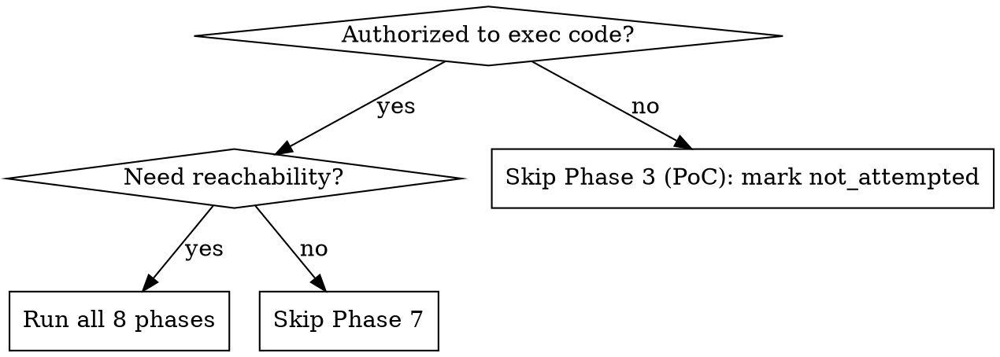

# Mythos-Style Vulnerability Scanner

## Overview

8-phase exploit-chain pipeline inspired by Cloudflare Mythos/Glasswing:
parallel hunt by attack class × code zone → PoC validation → adversarial
refutation → reachability tracing → JSON report.

**Authorized use only** — PoC execution requires sandbox + explicit authorization
(pentest engagement, CTF, security research, defensive audit).

## Decision: Which phases to run?



## Attack Class Defaults by Language

| Language | Default Classes |
|----------|----------------|
| C/C++ | `buffer_overflow`, `uaf`, `oob_read`, `oob_write`, `integer_overflow`, `format_string` |
| Rust | `unsafe_block_misuse`, `integer_overflow`, `panic_reachability` |
| Go | `race_condition`, `integer_overflow`, `path_traversal` |
| JS/TS | `prototype_pollution`, `injection`, `xss`, `deserialization` |
| Python | `injection`, `deserialization`, `ssrf`, `path_traversal` |
| Java | `injection`, `deserialization`, `xxe`, `idor` |

---

## Pipeline

**Phase 1 — Reconnaissance** (`Explore` subagent, full repo)

Survey languages, build system, trust boundaries, entry points, data flows
(untrusted input → sinks). Output: architecture summary + task queue
`[(attack_class, code_zone), ...]`.

---

**Phase 2 — Parallel Hunt** (use `superpowers:dispatching-parallel-agents`, cap 32)

One `general-purpose` subagent per `(attack_class, code_zone)` pair, scoped
to that zone. Each agent outputs:
- Candidate findings: file, line range, function, confidence (`high`/`medium`/`low`)
- Gaps: zones touched but not fully analyzable

---

**Phase 3 — PoC Generation & Validation**

For each `high`/`medium` finding:
1. Generate minimal harness + trigger
2. Compile in `/tmp/poc_<vuln_id>/` (Bash tool)
3. Execute → crash/abort/assertion = candidate confirmed
4. On failure: adjust hypothesis → retry (max **5 iterations**)
5. Status: `confirmed` | `plausible_unconfirmed` | `rejected`

```c
/* Minimal C/C++ harness */
#include <stdio.h>
int main(void) {
    /* [reproduce vulnerable state] */
    /* [trigger with crafted input — crash expected] */
    return 0;
}
```

---

**Phase 4 — Adversarial Validation**

For each `confirmed`/`plausible_unconfirmed` finding, spawn a **fresh subagent
with zero prior finding context**. Prompt: *"Try to prove this vulnerability does
NOT exist: [details]."* Agent may only refute, not create new findings.
Outcome: `validated` | `rejected`.

---

**Phase 5 — Gap Coverage**

Re-queue Phase 2 gaps as new `(attack_class, code_zone)` tasks using a
different analysis angle (taint vs. pattern, data-flow vs. control-flow).
Prioritize by proximity to trust boundaries.

---

**Phase 6 — Deduplication**

Group findings by root cause (same site/function/allocator). Promote
highest-severity as primary (`MYTHOS-NNN`). Move variants to `variants[]`.

---

**Phase 7 — Reachability Tracing**

For each validated finding, trace backward: can attacker-controlled input
reach this site? Use `semgrep`/`codeql`/`clang --analyze` if available;
fallback to grep + read. Set `reachable_from_untrusted_input: true/false`.
If `false`: downgrade severity one level (keep in report).

---

**Phase 8 — Structured Report**

Write `./reports/mythos_report_<ISO_timestamp>.json`:

```json
{
  "scan_metadata": { "repo_path": "", "timestamp": "", "attack_classes": [], "phases_completed": 8 },
  "findings": [{
    "vuln_id": "MYTHOS-001",
    "severity": "critical|high|medium|low",
    "attack_class": "buffer_overflow",
    "file": "src/parser.c",
    "line_range": [142, 158],
    "function": "parse_input",
    "root_cause": "...",
    "exploit_chain": ["oob_read_primitive", "control_flow_hijack"],
    "poc_status": "confirmed|plausible_unconfirmed|not_attempted|rejected",
    "reachable_from_untrusted_input": true,
    "reproduction_steps": [],
    "variants": []
  }],
  "gaps": [],
  "rejected": []
}
```

---

## Severity Rules

| Condition | Severity |
|-----------|----------|
| Confirmed PoC + reachable + RCE/privesc | `critical` |
| Confirmed PoC + reachable | `high` |
| Confirmed + unreachable OR plausible + reachable | `medium` |
| Plausible + unreachable OR not attempted | `low` |

---

## Common Mistakes

| Mistake | Fix |
|---------|-----|
| One agent for full repo | Decompose into `attack_class × zone` pairs |
| Skipping PoC for high findings | Always attempt Phase 3 |
| Phase 4 agent sees prior findings | Must start with zero context |
| Discarding unreachable bugs | Downgrade severity, keep in `findings[]` |
| Prose report | Output MUST be JSON — required for pipeline integration |
